# RNA测序数据分析流程 - 教程详解
在这个RNA测序数据分析的教程中，我们将以六组PE100的测序FASTQ数据（样本类型：6例人宫颈癌培养细胞样本）为例介绍RNA测序数据的差异基因表达常规分析流程。

其中，FASTQ数据来源：采用特有的芯片结合可逆末端终止碱基的测序技术，通过光学系统对 DNA 分子群的荧光信号进行图像采集，得到的图像信息通过 Basecall转换为待测碱基的序列信息。

## 分析全流程 ##

```bash
## 第一步：数据质控 ##
bash src/step1_qc.sh

## 第二步：去rRNA ##
bash src/step2_rm_rRNA.sh

## 第三步：比对到参考基因组
bash src/step3_align_genome.sh

## 第四步：基因和转路本定量
bash src/step4_count.sh

## 第五步：画图，差异基因分析及通路分析
bash src/step5_plots.sh
```

## 使用到的开源软件 ##
- [FASTP](https://github.com/OpenGene/fastp)

- [Bowtie 2](https://bowtie-bio.sourceforge.net/bowtie2/index.shtml)

- [HISAT2](https://daehwankimlab.github.io/hisat2/)

- [samtools](https://github.com/samtools/samtools)

- [StringTie](https://ccb.jhu.edu/software/stringtie/)

- [featureCounts](https://subread.sourceforge.net/featureCounts.html)

- [R](https://www.r-project.org/)

## 第一步：数据质控 ##
数据质量控制是RNA-Seq分析的关键步骤之一，这里使用软件fastp对原始测序FASTQ数据的测序reads进行质量评估和过滤，以确保我们分析的FASTQ数据质量良好，减少后续分析中的误差。

*完整代码参考 [github](https://github.com/RachelYue96/RNA-SEQ-tutorial) `src/step1_qc.sh` 脚本*

### 核心代码 ###
```bash
fastp \
    --in1 $ddir/${sampleid}_R1.fastq.gz \ ## 双端R1输入文件
    --out1 $odir/${sampleid}_1.clean.fastq.gz \ ## 双端R1输出文件
    --in2 $ddir/${sampleid}_R2.fastq.gz \ ## 双端R2输入文件
    --out2 $odir/${sampleid}_2.clean.fastq.gz \ ## 双端R2输出文件
    --adapter_fasta /share/data/reference/human/ALK/alk_adapter.fa \
    --detect_adapter_for_pe \ ## 自动检测双端数据接头
    --qualified_quality_phred 20 \
    --unqualified_percent_limit 20 \
    --length_required 150 \
    --n_base_limit 5 \ ## 设置一个序列中允许的最大 N 碱基数
    --low_complexity_filter \
    --complexity_threshold 30 \
    --json $odir/${sampleid}.fastp.json \ ## json结果文件
    --html $odir/${sampleid}.fastp.html \ ## html结果文件
    >> $log_file 2>&1 ## 导出日志
```

### 结果文件 ###
- 过滤后的fastq双端数据
- html结果文件
- json结果文件 </br>

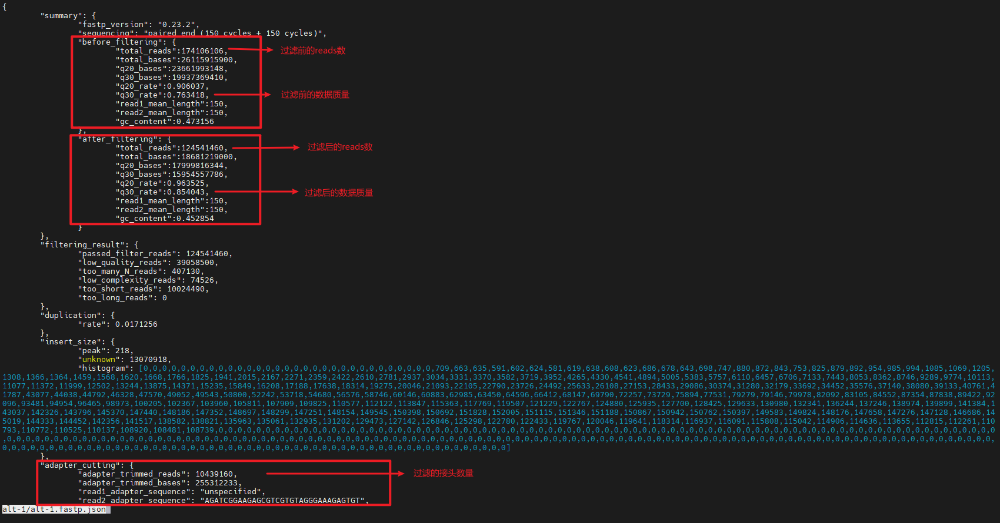

## 第二步：去rRNA ##
rRNA在RNA-Seq分析中通常不是我们关心的目标，这里使用软件bowtie2将测序FASTQ数据与已知的rRNA序列进行比对，再过滤掉比对上的reads

*完整代码参考 [github](https://github.com/RachelYue96/RNA-SEQ-tutorial) `src/step2_rm_rRNA.sh` 脚本*

### 下载rRNA参考基因组 ###
```bash
wget https://ftp.ncbi.nlm.nih.gov/genomes/all/GCF/000/001/405/GCF_000001405.40_GRCh38.p14/GCF_000001405.40_GRCh38.p14_rna_from_genomic.fna.gz

# extract rRNA seqs
zcat GCF_000001405.40_GRCh38.p14_rna_from_genomic.fna.gz |grep "^>" |grep "gbkey=rRNA" | awk '{print $1}'|sed 's/>//g' > rRNA_id.list

seqkit grep -f rRNA_id.list GCF_000001405.40_GRCh38.p14_rna_from_genomic.fna.gz > GRCh38.p14_rRNA.fasta #~3s

# 前17条 5S rRNA序列除了第9条有一个碱基之外，其他序列是一模一样的，去冗余只保留一条
le rRNA_id.list |sed '2,17d' > rRNA_rm16dup.id.list
seqkit grep -f rRNA_rm16dup.id.list GRCh38.p14_rRNA.fasta > GRCh38.p14_rRNA_rm16dup.fasta

# fai and dict
samtools faidx GRCh38.p14_rRNA_rm16dup.fasta
samtools dict GRCh38.p14_rRNA_rm16dup.fasta > GRCh38.p14_rRNA_rm16dup.dict

# bowtie2 index 生成索引文件
bowtie2-build GRCh38.p14_rRNA_rm16dup.fasta GRCh38.p14_rRNA_rm16dup.fasta #~2s
```

### 核心代码 ###
```bash
bowtie2 \
    --very-sensitive-local \
    --no-unal \
    --threads 16 \ ## 线程数
    -x /share/data/reference/human/grch38/rRNA/GRCh38.p14_rRNA_rm16dup.fasta \ ## 参考基因组
    -1 $ddir/${sampleid}_1.clean.fastq.gz \ ## fastp输出的R1结果文件
    -2 $ddir/${sampleid}_2.clean.fastq.gz \ ## fastp输出的R2结果文件
    --un-conc-gz $odir/${sampleid}.clean.fq.gz 2> $odir/${sampleid}.map2rRNAstats.txt \
    | samtools view \
            --no-PG \
            --bam \ ## 输出bam格式的结果文件
            --output $odir/${sampleid}.map2rRNA.bam - \ ## 设定结果文件名
    >> $log_file 2>&1 ## 导出日志文件
```

### 结果文件 ###
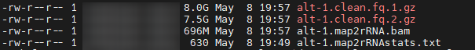
- 过滤rRNA后的fastq双端数据
- 包含详细比对信息的bam文件
- 统计rRNA在样本中占比的txt文件
    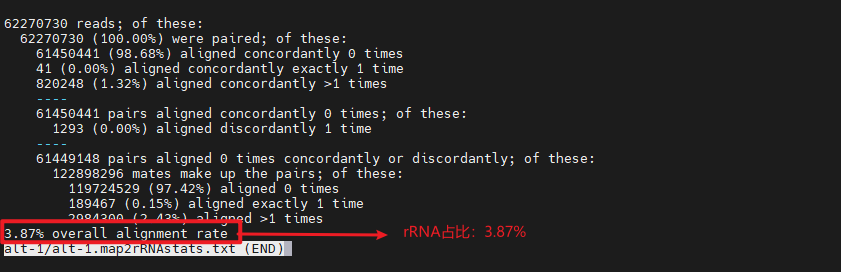

## 第三步：比对到参考基因组
将过滤掉rRNA序列后的FASTQ数据比对到与样本类型对应的参考基因组FASTA序列上

*完整代码参考 [github](https://github.com/RachelYue96/RNA-SEQ-tutorial) `src/step3_align_genome.sh` 脚本*

### 下载参考基因组 ###
```bash
# download the version 110 GRCh38's gtf, mRNA, fasta files
wget https://ftp.ensembl.org/pub/release-110/gtf/homo_sapiens/Homo_sapiens.GRCh38.110.gtf.gz
wget https://ftp.ensembl.org/pub/release-110/fasta/homo_sapiens/cdna/Homo_sapiens.GRCh38.cdna.all.fa.gz
wget https://ftp.ensembl.org/pub/release-110/fasta/homo_sapiens/dna/Homo_sapiens.GRCh38.dna.primary_assembly.fa.gz

# build hisat2 index for fasta file
hisat2-build Homo_sapiens.GRCh38.dna.primary_assembly.fa genome_GRCh38_110_index
```

### 核心代码 ###
```bash
hisat2 \
    --threads 16 \
    --dta \
    ## 设定参考基因组
    -x /share/data/reference/human/hg38/gene/UHRR/ref/genome_index/genome_GRCh38_110_index \
    ## 过滤rRNA后的双端数据
    -1 $ddir/${sampleid}.clean.fq.1.gz \
    -2 $ddir/${sampleid}.clean.fq.2.gz \
    ## 统计文件
    --summary-file $odir/${sampleid}.tran_summary.txt \
    ## 导入samtools，将SAM转为BAM文件
    | samtools view \
            --threads 16 \
            --bam --no-PG /dev/stdin \
    ## 对BAM文件排序
    | samtools sort \
            /dev/stdin \
            --threads 16 \
            -o $odir/${sampleid}.tran.sorted.bam \
    ## 为BAM文件创建索引
    && samtools index \
            $odir/${sampleid}.tran.sorted.bam \
    && stringtie \
            $odir/${sampleid}.tran.sorted.bam \
            -p 16 \
            -G /share/data/reference/human/hg38/gene/UHRR/ref/Homo_sapiens.GRCh38.110.gtf \
            -e \
            -b $odir/Ballgown \
            -o $odir/${sampleid}.tran.gtf \ ## 组装后转路本信息
    >> $log_file 2>&1 ## 日志文件
```

### 结果文件 ###
1. BAM 文件
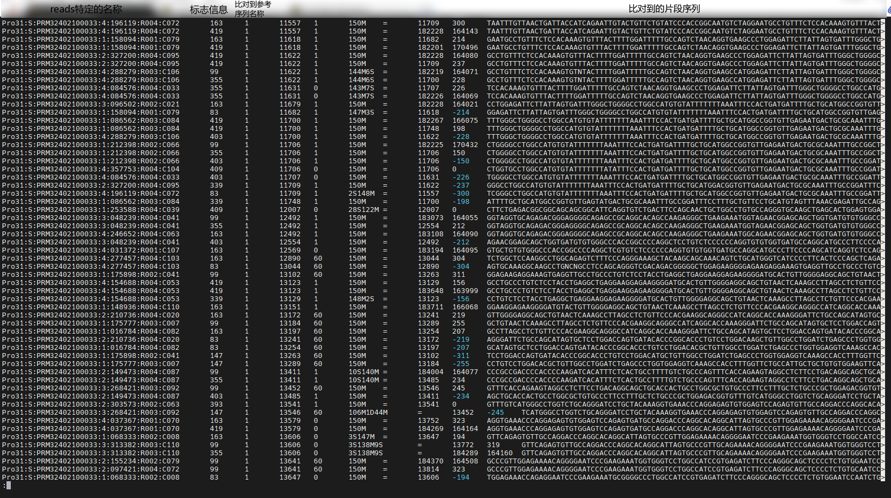
2. gtf文件
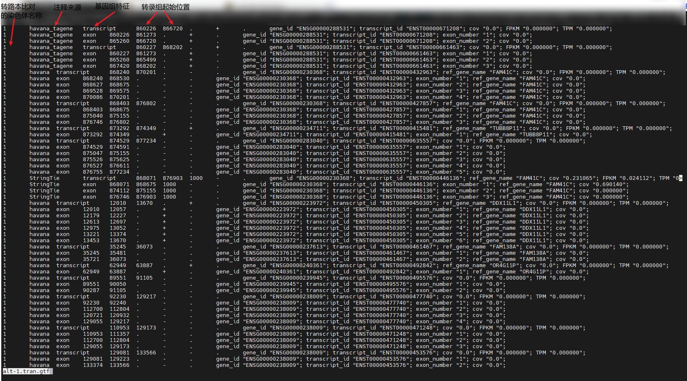

## 第四步：基因和转路本定量
*完整代码参考 [github](https://github.com/RachelYue96/RNA-SEQ-tutorial) `src/step4_count.sh` 脚本*

### 核心代码 ###
```bash
## 输出每个样本基因的表达量，并将结果整理成一个包含基因ID和对应表达量的文本文件
featureCounts \
    -p \ ## 输入双端测序数据
    -T 8 \ ## 线程数
    -f \ ## 输出feature（特征）级数据
    ## 指定注释文件
    -a /share/data/reference/human/hg38/gene/UHRR/ref/Homo_sapiens.GRCh38.110.mRNA.gtf \
    ## 指定输出文件
    -o $ddir/${sampleid}_gene_level_counts
    $ddir/${sampleid}.tran.sorted.bam ## 指定输入文件

less $ddir/${sampleid}_gene_level_counts | grep '^E' | awk '{print \$1\"\\t\"\$NF}' | awk '{sums[\$1] += \$2} END {for (i in sums) print i, sums[i]}' | sort -k1 > $ddir/${sampleid}_allgene.counts.txt

sed -i '1igene_id\tcounts' $ddir/${sampleid}_allgene.counts.txt
```

```r
## 使用biomaRt包用来统计基因的表达矩阵
library('biomaRt')

wkdir <- "/share/result/sequencer/salus/video_example/RNA-seq"

files_allg <- list.files(path=paste0(wkdir, "/results/hisat2_stringtie"), pattern="*_allgene.counts.txt$", full.names=TRUE, recursive=TRUE)

names(files_allg) <- gsub("_allgene.counts.txt$", "", basename(files_allg))
exprs <- list()
exprs_trans <- list()

for (i in 1:length(files_allg)) {
  exprs[[i]] <- read.table(paste0(files_allg[i]), col.names = c("gene_id", names(files_allg)[i]), check.names = FALSE)
}

merged_exprs <- Reduce(function(x, y) merge(x, y, by = "gene_id"), exprs)
merged_exprs <- merged_exprs[-nrow(merged_exprs), ]
write.csv(merged_exprs, file = paste0(wkdir, "/results/RNA_counts/allgene_count_matrix.txt"),row.names = FALSE)
....
```
*完整代码参考 [github](https://github.com/RachelYue96/RNA-SEQ-tutorial) `src/summary_counts.r` 脚本*

### 结果文件 ###
- 基因表达矩阵
  
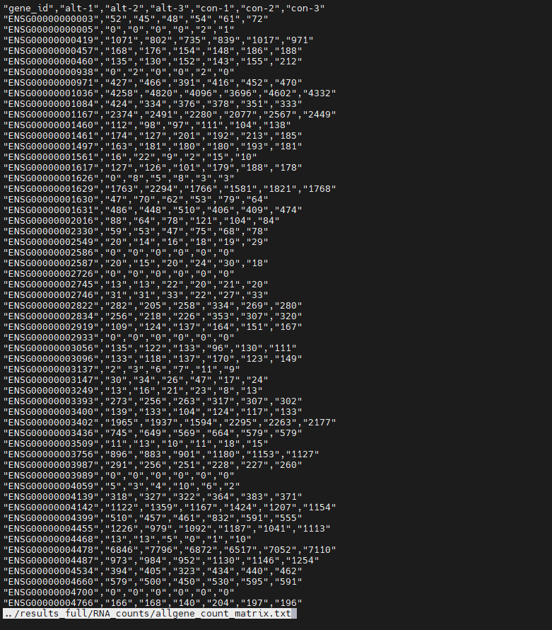

## 第五步：画图，差异基因分析及通路分析
在RNA-Seq分析中，我们经常关心不同条件下基因表达的变化。差异基因表达分析可以帮助我们识别在不同样本组之间表达量显著不同的基因。这对于理解生物学过程、疾病机制以及药物作用至关重要

*完整代码参考 [github](https://github.com/RachelYue96/RNA-SEQ-tutorial) `src/step5_plots.sh` 脚本*

### 差异基因分析核心代码 ###
```r
library(DESeq2)
library(clusterProfiler)
library('biomaRt')

# Set the working directory
wkdir <- "/share/result/sequencer/salus/video_example/RNA-seq/"
setwd(wkdir)

# 使用read.table()函数导入上一步生成的基因表达矩阵
outputPrefix <- "results/pipe_plots/"
dir.create(paste0(wkdir, outputPrefix))

countdata <- read.table("results/RNA_counts/allgene_count_matrix.txt", header=TRUE, row.names=1, check.names=FALSE, sep=",")
countdata <- as.matrix(countdata)

# 定义样本名称和样本的实验条件，区分实验组和对照组
samples <- c('alt-1', 'alt-2', 'alt-3', 'con-1', 'con-2', 'con-3')
conditions <- c('Treated', 'Treated', 'Treated', 'Control', 'Control', 'Control')
coldata <- DataFrame(condition = factor(conditions), row.names = samples)

# 使用DESeq()函数执行差异表达分析
ddsHTSeq <- DESeqDataSetFromMatrix(countData = countdata, colData = coldata, design = ~ condition)
dds <- DESeq(ddsHTSeq)

#######################################################
# 再通过一系列代码处理差异表达分析的结果，包括排序、转换数据格式、映射基因ID，过滤p值或padj值为NA的数据等等，便于下一步的富集分析
```

### 差异基因分析结果文件 ###
- 差异基因结果表格, 包括了：不同条件之间的表达倍数变化， log2 fold change 的标准误差，统计检验值，未经校正的 p 值和 经过多重假设检验校正后的调整 p 值
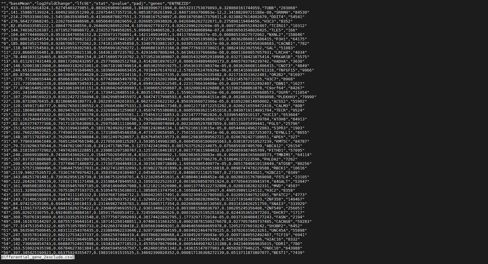

- 可以通过对padj和log2 fold change设定阈值筛选差异基因集。根据筛选后的差异基因集，绘制PCA图，热图等一系列图来识别是否包含异常样本，对照组和实验组之间是否存在显著的差异基因表达
    1. PCA图 *(识别是否包含异常样本)*

    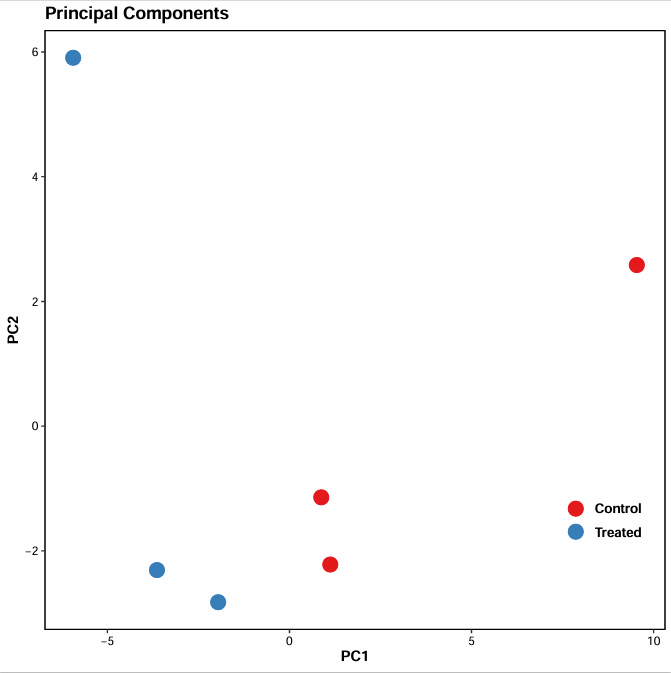

    2. 热图 *(对照组和实验组之间是否存在显著的差异基因表达)*

    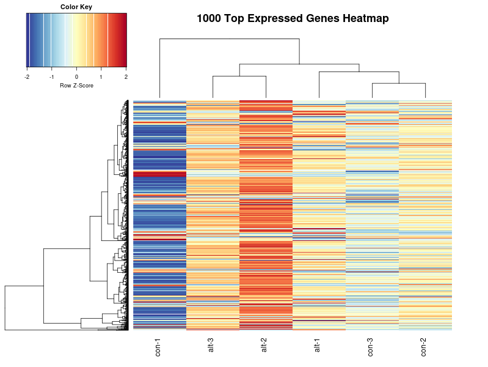

### 富集分析核心代码 ###
```r
library(DOSE)
generate_dotplot <- function(ont) {
  gse <- gseGO(geneList=kegg_gene_list,
               ont = ont,
               keyType = "ENTREZID",
               minGSSize = 3,
               maxGSSize = 800,
               pvalueCutoff = 0.05,
               verbose = TRUE,
               OrgDb = org.Hs.eg.db,
               pAdjustMethod = "none")
  gse_df <- as.data.frame(gse)
  dir.create(paste0(wkdir, "/results/pipe_plots/GO/"))
  write.csv(gse_df, file = paste0(wkdir, "/results/pipe_plots/GO/", "GSE_GO_", ont, "_2exclude.csv"))
  p <- dotplot(gse, showCategory=10, split=".sign", color="pvalue") + facet_grid(.~.sign) + ggtitle(ont)
  ggsave(paste0(wkdir, "/results/pipe_plots/GO/", "GSE_GO_", ont, "_2exclude.png"), plot = p, width = 9, height = 12, dpi = 300)
}

# GO注释会根据三种功能大类【分子生物学功能（Molecular Function，MF）、生物学过程（Biological Process，BP）和细胞学组分（Cellular Components，CC）】
generate_dotplot('BP')
generate_dotplot('CC')
generate_dotplot('MF')

# KEGG
res <- gseKEGG(
  kegg_gene_list,    # 根据logFC排序的基因集
  organism = "hsa",    # 人的拉丁名缩写
  minGSSize = 3,
  pvalueCutoff = 0.05,
  pAdjustMethod = "none"
)
res_df <- as.data.frame(res)
dir.create(paste0(wkdir, "/results/pipe_plots/KEGG/"))
write.csv(res_df, file = paste0(wkdir, "/results/pipe_plots/KEGG/", "GSE_KEGG_2exclude.csv"))

k <- dotplot(
  res,
  showCategory=10,
  color="pvalue",
  split=".sign") + facet_grid(.~.sign) + ggtitle("KEGG")
ggsave(paste0(wkdir, "/results/pipe_plots/KEGG/", "GSE_KEGG_2exclude.png"), plot = k, width = 9, height = 12, dpi = 300)
```

### 富集分析结果文件 ###
1. GO - BP

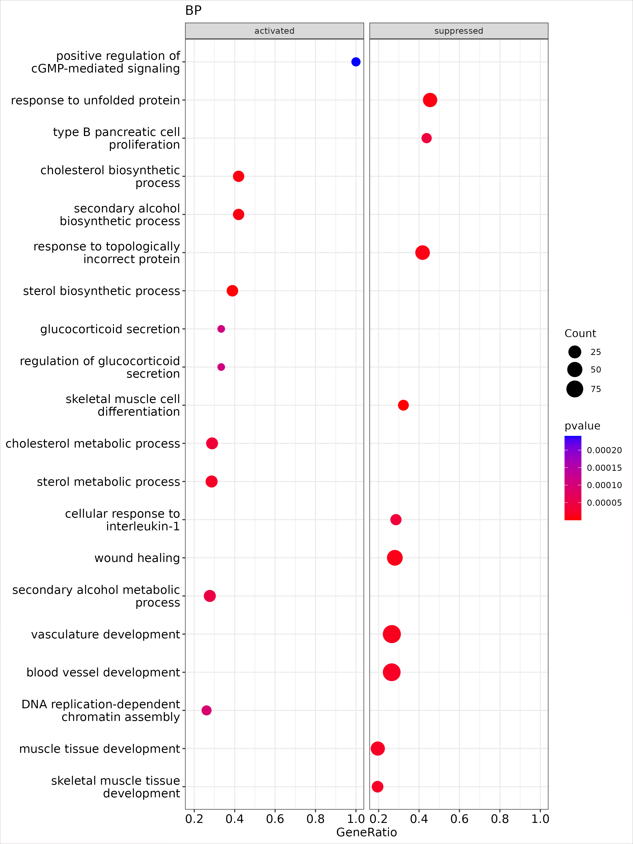

2. KEGG

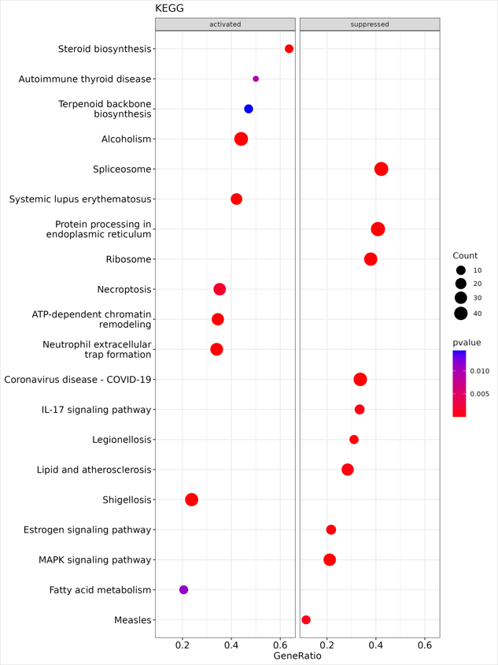

